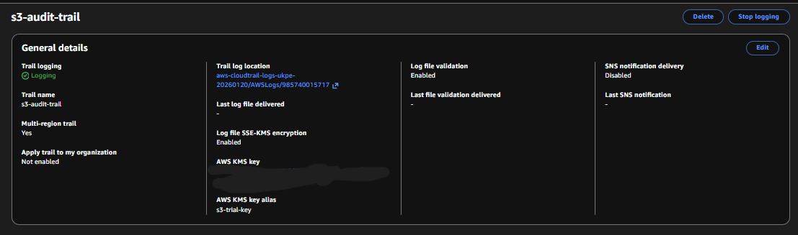
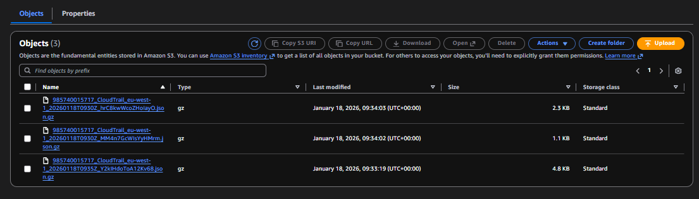

# AWS S3 Security Assessment & Hardening Case Study

---

## Project Overview

This project simulates a real-world AWS S3 bucket misconfiguration that resulted in unintended public data exposure.

The objective of this assessment was to:

- Identify insecure S3 bucket configuration
- Validate unauthorised public access
- Implement layered remediation controls
- Verify logging and monitoring functionality

This case study demonstrates practical cloud security assessment and remediation aligned with AWS security best practices.

---

## Risk Scenario

The S3 bucket was intentionally configured with a permissive public-read bucket policy and lacked encryption at rest.

This misconfiguration exposed stored objects to unauthenticated access via direct HTTP requests, representing a common cloud storage security vulnerability.

Public S3 misconfigurations are frequently discovered by automated reconnaissance tools and can lead to large-scale data exposure.

---

## Exposure Validation

Unauthenticated object retrieval was performed to confirm public accessibility.

Successful access to stored objects without credentials validated that the bucket was publicly exposed.

#### Evidence

---

## Business Impact

If exploited in a production environment, this misconfiguration could result in:

- Unauthorised disclosure of sensitive customer data  
- Regulatory non-compliance (GDPR, PCI-DSS, HIPAA)  
- Reputational damage  
- Automated exploitation by cloud asset scanning bots  

Cloud storage exposure remains one of the most common causes of public data breaches.

---

## Remediation Actions Implemented

The following security controls were applied to harden the bucket:

- Removed permissive bucket policies  
- Enabled **S3 Block Public Access**  
- Enforced least-privilege IAM access using an EC2 role  
- Enabled **AWS KMS server-side encryption**  
- Configured **CloudTrail data event logging** for object-level visibility  

Policy examples used during remediation are available in the `policies/` directory.

---

## Security Architecture After Hardening

The secured configuration enforces:

- Account-level and bucket-level public access restrictions  
- Role-based access control via IAM  
- Encryption of stored objects using AWS KMS  
- Object-level audit logging through CloudTrail  

This layered approach ensures prevention, protection, and detection controls are in place.

---

## Monitoring & Audit Verification

CloudTrail was configured to capture S3 data events, enabling object-level monitoring.

Following object access activity, CloudTrail log files were successfully generated and stored in the designated logging bucket. The presence of S3 data event logs confirmed that object-level access activity was being recorded for audit and investigation purposes.

#### Evidence

---

## Lessons Learned

Cloud storage misconfigurations can result in immediate and large-scale exposure if not properly governed.

Effective cloud security requires:

- Strict access control enforcement  
- Encryption by default  
- Centralised logging and monitoring  
- Defence-in-depth security architecture  

Preventive and detective controls must be implemented together to reduce risk.

---

## Skills Demonstrated

- S3 bucket policy analysis and remediation  
- IAM least-privilege role configuration  
- AWS KMS encryption implementation  
- CloudTrail data event configuration and validation  
- Cloud security risk assessment and mitigation  

---

## Disclaimer

This project was conducted within a controlled AWS environment for educational and security research purposes.
